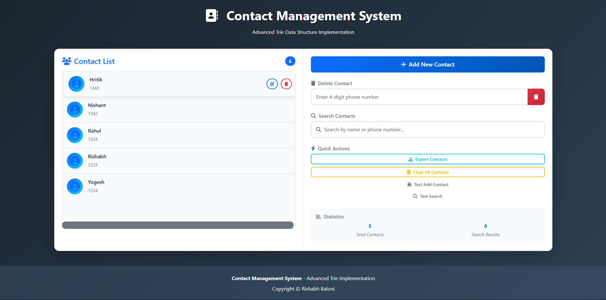

# Contact Management System V2.0 - Trie Data Structure Implementation

## 🚀 **Enhanced Features**

### **Core Functionality**
- **Dual Search Capability**: Search by both contact name AND phone number
- **Case-Insensitive Name Search**: Find "anna" when typing "Anna"
- **Real-time Autocomplete**: Instant results as you type
- **Smart Search Logic**: Automatically detects if you're searching by name or number

### **User Experience Improvements**
- **Bootstrap Modal Interface**: Clean, professional contact addition form
- **Dynamic Contact List**: Real-time updates when adding/removing contacts
- **Search Clear Button**: Easy one-click search clearing with 'X' icon
- **No Results Message**: Clear feedback when search yields no results
- **Enhanced UI**: Modern styling with hover effects and better visual hierarchy

### **Data Persistence**
- **localStorage Integration**: Contacts persist across browser sessions
- **Automatic Saving**: All changes are immediately saved
- **Data Recovery**: Contacts load automatically on page refresh

### **Technical Implementation**
- **Enhanced Trie Class**: Extended with name indexing and unified search
- **ES6 Modules**: Modern JavaScript architecture
- **Responsive Design**: Bootstrap-based mobile-friendly interface
- **Performance Optimized**: Efficient search algorithms with O(k) complexity

## 🔧 **How It Works**

1. **Trie Construction**: Phone numbers stored as paths, names indexed separately
2. **Unified Search**: Single search box intelligently handles both name and number queries
3. **Real-time Results**: DFS traversal provides instant autocomplete suggestions
4. **Persistent Storage**: Browser localStorage ensures data survival across sessions

## 📱 **Usage**

- **Add Contact**: Click "Add New Contact" button → Fill modal form → Save
- **Search**: Type name or phone number → See real-time results
- **Delete**: Enter 4-digit number → Click delete button
- **Clear Search**: Click 'X' button or press Escape key

## 🛠 **Technology Stack**

- **Frontend**: HTML5, CSS3, JavaScript (ES6)
- **Data Structure**: Custom Trie implementation
- **UI Framework**: Bootstrap 4.4.1
- **Icons**: Font Awesome
- **Storage**: Browser localStorage

## 🎯 **Perfect For**

- **Portfolio Projects**: Demonstrates advanced data structure knowledge
- **Learning**: Educational example of Trie implementation
- **Practical Use**: Functional contact management system
- **Code Review**: Clean, well-structured JavaScript code

---

**Current Version**: Full-featured contact management with name search, persistence, and modern UI

*Built with ❤️ by Rishabh Baloni*
